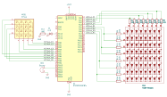
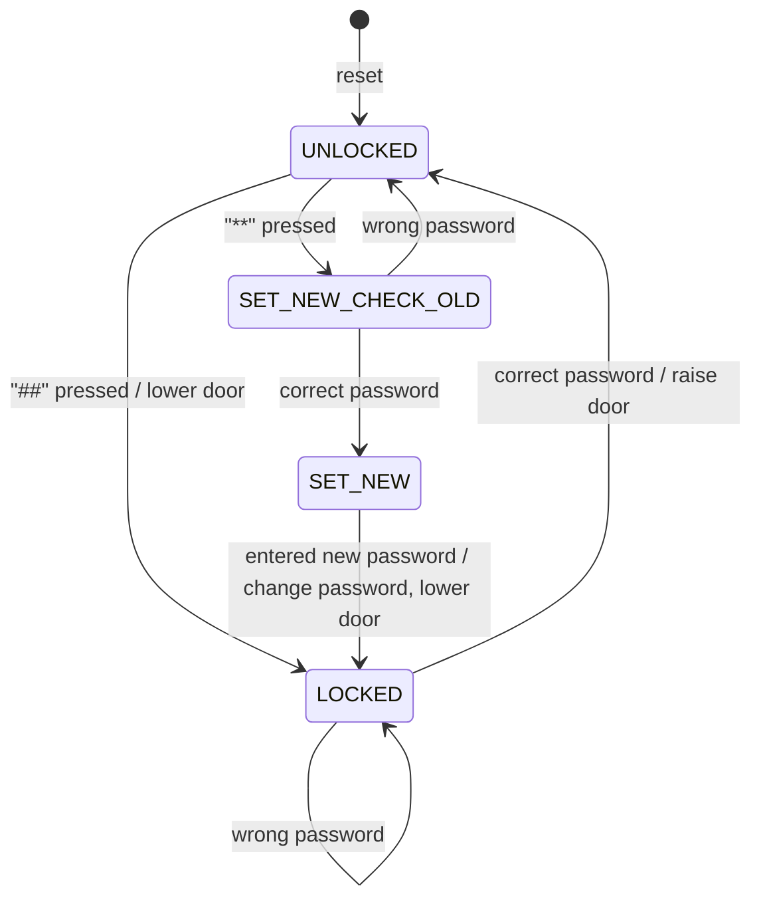

## Description

The system must lift a garage door when the correct password is entered.<br>
The password will be a sequence of numbers introduced using a 4x4 matrix keyboard or another custom system with buttons (14 buttons for numbers + control buttons). '\*' clears the input sequence, '\#' enters the input sequence.<br>
If the password is correct, the garage door unlocks and lifts. When unlocked, a new password can be set or the garage door can be lowered and locked, depending on the control buttons pressed.<br>
The garage door will be emulated using a 4x4 LED matrix display. Right/wrong password entries will be signaled by a passive buzzer.

## Hardware components

- "blue pill" board with STM32f103c8t6 chip
- 4x4 matrix keyboard
- 8x8 → 4x4 LED matrix (row cathode) mocking a garage door
- passive buzzer
- blinky LED on the board
- STLink V2 clone for upload & debug



## Software implementation

The application leverages STM32 HAL and CubeMX for configuration.
Based on the flicker detection rate of the human eye, a minimum refresh rate of 70-100Hz shall be chosen for the LED matrix. Each period is split in 16 time slots in which the LEDs are lit individually according to the 16bits of the pattern. So, for 100Hz we would need a timer with `period = 1 / (100*16) = 625E-6 = 625μs`.<br>
Display and buzzer functionalities are abstracted on async functions operating on buffers.<br>
```C
void LED4x4Draw(uint16_t pattern, uint16_t T10ms);
void playNote(uint16_t FHz, uint16_t T10ms);
```
The following microcontroller peripherals were used:<br>
- TIM2: high frequency for buzzer tones
    - 250kHz → 125kHz F, 50...20.833Hz tone adjusted by counter period reg: 2500...6
    - [optional] PWM operation: cnt period reg = 2x output compare reg
- TIM4: medium frequency for drawing on the LED matrix
    - 2kHz, /16=125Hz display refresh rate
- TIM3: low frequency (10ms) for handling tone, drawing durations and keypad sampling



---

Video showcase [here](https://youtu.be/XRSfc6xtMOY)
